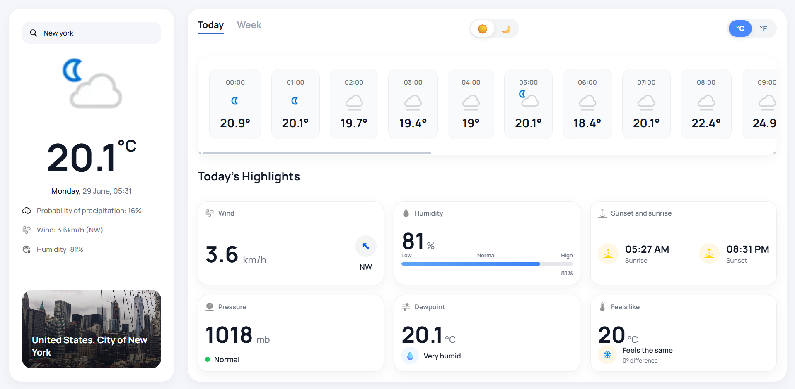
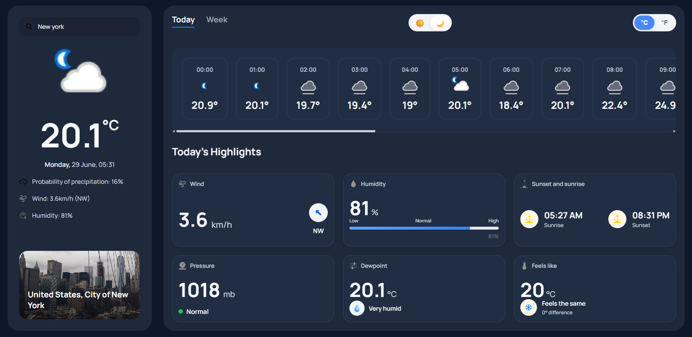

# 🌦️ Weather App

A modern weather application built with **React** and **WeatherAPI**.  
It provides current weather conditions, hourly forecasts, 7-day forecasts, detailed weather highlights, theme switching, and a clean responsive interface.

## ✨ Features

- 🔍 Search for any city worldwide
- 📍 City search with autocomplete
- 🌡️ Switch between Celsius and Fahrenheit
- 📅 Hourly weather forecast
- 📆 7-day weather forecast
- 📊 Detailed weather highlights:
    - Wind
    - Humidity
    - Pressure
    - Dew Point
    - Feels Like
    - Sunrise & Sunset
- 🌙 Light / Dark theme
- 🎨 Modern responsive UI
- 🔔 Toast notifications for invalid locations
- 📱 Responsive design

---

## 🔗 Live Demo

https://nazar-galicia.github.io/React-weather-app/

## 🛠️ Technologies

- React
- JavaScript (ES6+)
- CSS3
- Vite
- WeatherAPI
- React Hot Toast

---

## 📸 Screenshots

### Light Theme



### Dark Theme



---

## 🚀 Getting Started

Clone the repository

```bash
git clone https://github.com/Nazar-Galicia/React-weather-app.git
```

Navigate to the project folder

```bash
cd weather-app
```

Install dependencies

```bash
npm install
```

Start the development server

```bash
npm run dev
```

---

## 📂 Project Structure

```text
src/
│
├── components/
├── context/
├── hooks/
├── assets/
└── App.jsx
```

---

## 🌐 API

This project uses the **WeatherAPI** service to fetch:

- Current weather
- Hourly forecast
- 7-day forecast
- Weather conditions
- Astronomy data

Documentation:

https://www.weatherapi.com/docs/

---

## 🎯 Future Improvements

- ⭐ Favorite cities
- 📈 Temperature charts
- 🌦️ Dynamic backgrounds based on weather
- 🌍 Automatic geolocation
- 🌬️ Air quality information
- 🌙 Moon phase
- UV index visualization

---

## 👤 Author

Developed by **Nazar Galicia**

GitHub:
https://github.com/Nazar-Galicia

---

## 📄 License

This project is licensed under the MIT License.